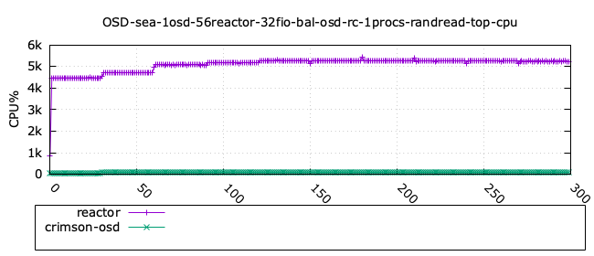
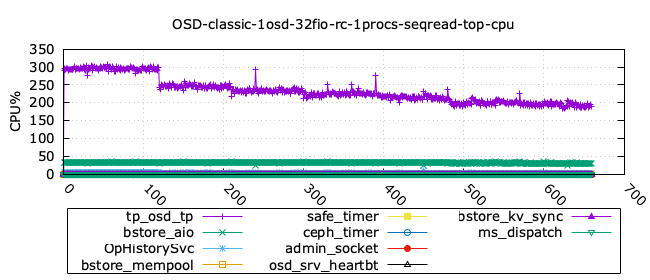
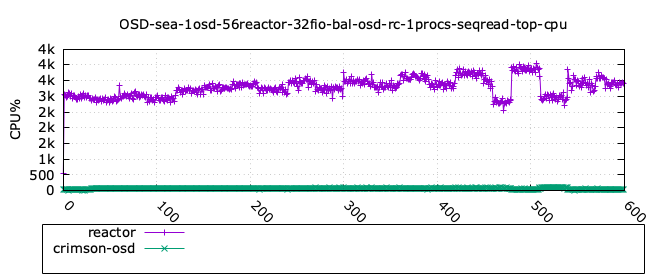
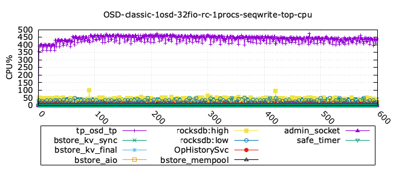

## Seastore as the native object storage in Crimson

We are very excited to present the performance comparison between the Classic
OSD and Seastore, the native object storage engine in
[Crimson](https://ceph.io/en/news/crimson/) OSD.

We show that Seastore has better performance than Classic OSD for random read
4k, and the same performance for the sequential workloads read and write 64k.
Only the random write 4k shows a slightly lower performance for Seastore, for
which we are actively working on optimisations, in an effort lead by Samuel Just.

These results remain consistent and there is no regression in terms of the
performance of Seastore with respect to the results shown from build 6aab5c07ae (May
2025, internal technical report and available in the Crimson slack channel).

In a nutshell, here are the key points about the comparison:

  - We used the same Ceph dev build from main branch (hash 785976e3179)
    for all test runs.

  - Single OSD, 32 RBD volumes each of size 2 GB, four FIO jobs per
    volume.

  - All configurations for Crimson used the balanced OSD algorithm on a
    single NUMA socket (this is to be consistent with previous tests).

  - We used the traditional workloads (random read 4k, random write 4k,
    sequential read 64k and sequential write 64k).

  - We used the **dual reactor configuration** for Seastore (using the
    max 56 CPU cores in the NUMA socket 0) and similarly for the Classic
    OSD. For details on this, please have a glance at our previous 
   [blog entry](https://ceph.io/en/news/blog/2025/crimson-balance-cpu-part1/).

# Seastore vs Classic OSD - max CPU cores configuration 

In this section we show the performance comparison between the OSD
Classic vs Crimson/Seastore for the dual reactor configuration. This
consists on using the max 56 CPU cores in the NUMA socket 0 of the
system used (Intel(R) Xeon(R) Platinum 8276M CPU @ 2.20GHz). This is the
same CPU configuration used in the report on May 29,2025 previously
published. The tests have been performed with the same hardware and
software configuration, see the Appendix below for details.

## Randread 4k


Seastore clearly shows a significant performance improvement over Classic for
this workload, with a maximum throughput of  400K IOPS vs 130K IOPS,
respectively.

<details>
<summary>Click to see the CPU utilisation.</summary>

| _Classic_ | _Seastore_ |
|:---------:|:---------:|
|||

 - Note: we do not show the memory utilisation since its mostly remains
    constant, and does not add much to the analysis.

</details>

## Randwrite 4k


There is clear opportunity to improve the performance of Seastore for this
workload. This is a very active area of work, led by Samuel Just, in a number
of optimisations for Seastore. 

<details>
<summary>Click to see the CPU utilisation.</summary>

| _Classic_ | _Seastore_ |
|:---------:|:---------:|
|||

</details>

## Seqread 64k


Notice that the performance of Seastore is less than 10% lower than Classic for
this workload, for practical purposes they can be considered the same.

<details>
<summary>Click to see the CPU utilisation.</summary>

| _Classic_ | _Seastore_ |
|:---------:|:---------:|
|||

</details>


## Seqwrite 64k 


Similarly as the previous workload, the performance of Seastore is within 10%
than Classic, and hence can be considered the same.

<details>
<summary>Click to see the CPU utilisation.</summary>

| _Classic_ | _Seastore_ |
|:---------:|:---------:|
|||

</details>

## Conclusions

In this blog entry, we have shown the performance  of Seastore OSD vs the
Classic OSD. This shows that Seastore has better performance for
random read 4k, and the same performance for the sequential workloads read and
write 64k. Only the random write 4k shows a lower performance for
Seastore, for which we are actively working on optimisations. We will continue
to monitor the performance of Seastore OSD and report on any significant
changes in future blog entries. We would like to thank Samuel Just for his
insights on the performance of Seastore as discussed in the Crimson community
meeting calls.

## Appendix: configuration details

The tests were executed on a single node cluster, o05, in the Sepia Lab.

The following is the summary of hardware and software configuration:

- CPU: 2 x Intel(R) Xeon(R) Platinum 8276M CPU @ 2.20GH (56 cores each)

- Memory: 384 GB

- Storage: Drives: 8 x 93.1 TB NVMe

- OS: Centos 9.0 on kernel 5.14.0-511.el9.x86_64

- Kernel: 5.4.0-91-generic

- Ceph: squid dev build from the main branch, hash 785976e3179 (Fri Aug
  29 2025)

- podman version 5.2.2

- FIO: 3.28 (using the librbd engine for workloads, and the AIO engine
  for precondition of the NVMe drives).

We build Ceph in developer mode with the following options:

```bash
WITH_CRIMSON=true ./install-deps.sh
$ ./do_cmake.sh -DWITH_CRIMSON=ON -DCMAKE_BUILD_TYPE=RelWithDebInfo -DCMAKE_CXX_FLAGS="-fno-omit-frame-pointer" -DWITH_TESTS=OFF && ninja -C build -j 20 -l 20 -k 20 && ninja -C build install
```

All the tests for this report were executed using `vstart.sh` for
cluster creation, using a single node. In terms of storage, the single
configuration tested involved 32 RBD volumes, each of 2 GB size.

The RBD pool was created without replication (size 1). In the snippet below, we
show the options used for the RBD pool and volumes. 

<details>
<summary>Click to see the RBD configuration details.</summary>

```bash

    if pgrep crimson; then
    	bin/ceph daemon -c /ceph/build/ceph.conf osd.0 dump_metrics > /tmp/new_cluster_dump.json
    fi

    # basic setup
    bin/ceph osd pool create rbd 128
    bin/ceph osd pool application enable rbd rbd
    bin/ceph osd pool set rbd size 1 --yes-i-really-mean-it

    [ -z "$NUM_RBD_IMAGES" ] && NUM_RBD_IMAGES=1
    [ -z "$RBD_SIZE" ] && RBD_SIZE=2GB
    for (( i=0; i<$NUM_RBD_IMAGES; i++ )); do
      bin/rbd create --size ${RBD_SIZE} rbd/fio_test_${i}
      rbd du fio_test_${i}
      echo "Prefilling rbd/fio_test_${i}"
      bin/rbd bench -p rbd --image fio_test_${i} --io-size 64K --io-threads 1\
        --io-total ${RBD_SIZE} --io-pattern seq --io-type write  && rbd du fio_test_${i}
    done

    bin/ceph status
    bin/ceph osd dump | grep 'replicated size'

    # Show pool’s utilization statistics:
    rados df
    # Turn off auto scaler for existing and new pools - stops PGs being split/merged
    bin/ceph osd pool set noautoscale
    # Turn off balancer to avoid moving PGs
    bin/ceph balancer off
    # Turn off deep scrub
    bin/ceph osd set nodeep-scrub
    # Turn off scrub
    bin/ceph osd set noscrub
    # Turn off RBD coalescing
    bin/ceph config set client rbd_io_scheduler none 
```

</details>
